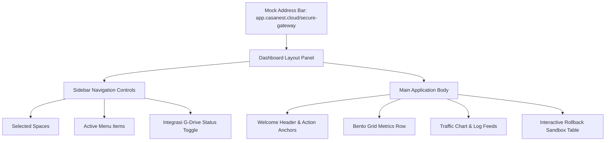

# CasaNest Landing Page Redesign Report (SaaS Style)

This report details the redesign of the CasaNest landing page to match the premium, soft-blue SaaS visual style of Reference Image 2 and Reference Image 3, and documents the integration of the React Bits `<Aurora />` component.

---

## Files Created & Modified

1.  **[style.css](file:///c:/xampp/htdocs/9drive/frontend/src/style.css)** [MODIFY]:
    *   Added `.mesh-gradient-bg` configuration class containing the specified radial and linear gradient combination.
    *   Defined pulsing animation keyframes for active gateway connection indicators (`pulse-dot`).
    *   Configured beautiful custom scrollbars for table scroll behaviors (`custom-scrollbar`).
2.  **[Aurora.tsx](file:///c:/xampp/htdocs/9drive/frontend/src/components/ui/Aurora.tsx)** [NEW]:
    *   Integrated the `<Aurora />` canvas WebGL animation component from React Bits.
    *   Fully typed the component using TypeScript (`AuroraProps` interface).
    *   Linked the WebGL renderer to utilize `ogl` (WebGL wrapper).
3.  **[LandingNavbar.tsx](file:///c:/xampp/htdocs/9drive/frontend/src/components/landing/LandingNavbar.tsx)** [NEW]:
    *   Frosted glass sticky navigation bar (`backdrop-blur-[20px] bg-white/72`).
    *   Includes logo, text, anchors, free tier badge, and responsive drawer menu for mobile layouts.
    *   Detects if the user is already authenticated to swap login/signup CTA triggers for a "Go to Dashboard" button.
4.  **[LandingHero.tsx](file:///c:/xampp/htdocs/9drive/frontend/src/components/landing/LandingHero.tsx)** [NEW]:
    *   Centered typography structure with size 76px desktop / 42px mobile.
    *   Uses green status beacon with verified gateway label.
    *   Exposes clean app routes (`/register`, `/login`, `/dashboard`).
5.  **[LandingDashboardPreview.tsx](file:///c:/xampp/htdocs/9drive/frontend/src/components/landing/LandingDashboardPreview.tsx)** [NEW]:
    *   Interactive mock dashboard layout with reactive React-based state:
        *   **Drive Unlinking**: Toggling "Disconnect" in the sidebar status card instantly changes sync state (from "Synced" to "Unlinked"), sets Gateway mode to "Inactive", and changes integrity check badge from green "Passing" to red "Threat: Unlinked".
        *   **File Rollback**: Clicking "Rollback to Drive" on mock deleted items shifts state to "Restoring..." and changes to "Restored Cleanly" after 1.6s.
        *   **Safe Sync**: Simulates a full cryptographic network refresh with a custom 2-second loader sync trigger.
        *   **Toaster**: Renders success, warning, info, or error toasts in the bottom-right corner with a 4s dismiss timer.
6.  **[LandingFeatureCards.tsx](file:///c:/xampp/htdocs/9drive/frontend/src/components/landing/LandingFeatureCards.tsx)** [NEW]:
    *   Three-card grid explaining zero-knowledge, rollback windows, and locking checks.
    *   Horizontal dark card summary for drive.file, encrypted tokens, 1:1 user checks, and isolation rules.
    *   Detailed rollback backup restoration section.
7.  **[LandingPage.tsx](file:///c:/xampp/htdocs/9drive/frontend/src/pages/LandingPage.tsx)** [MODIFY]:
    *   Rebuilt coordinator mapping navbar, hero, preview mockup, capability cards, and a clean footer.
    *   Mounted `<Aurora />` background component under an absolute container behind the hero element.

---

## Ambient Aurora Backdrop Configuration
*   **Colors**: Primary blue (`#2563EB`), Soft blue accent (`#60A5FA`), and backdrop fill (`#DBEAFE`) to seamlessly blend with the CasaNest theme.
*   **Settings**: Speed: `0.5` (calm motion), Amplitude: `1.0`, Blend: `0.5`.
*   **Dependencies**: Installed `ogl` package:
    ```bash
    npm install ogl
    ```

---

## Background Gradient Specification
The ambient mesh background is rendered via:
```css
radial-gradient(circle at 20% 10%, rgba(37, 99, 235, 0.18), transparent 34%),
radial-gradient(circle at 80% 5%, rgba(96, 165, 250, 0.28), transparent 36%),
linear-gradient(180deg, #EEF4FF 0%, #F8FBFF 55%, #FFFFFF 100%);
```

---

## Dashboard Preview Structure



---

## Responsive Spacing Adjustments
*   **Viewport < 768px (Mobile)**: Navigation drawer toggle, hero heading size 42px, vertical grid stacking.
*   **Viewport 768px - 1024px (Tablet)**: Scrollable recovery table, 2-column metrics cards.
*   **Viewport > 1024px (Desktop)**: Fully aligned sidebar list, SVG line chart animations, tooltips.
